# EC2 を起動する
このハンズオンでは以下を学習します。

* GUI, CLI の両方で EC2 インスタンスを起動する
* EC2 に接続する

## 事前準備
このハンズオンでは Cloud 9, CloudShell を使用します。

Cloud 9, CloudShell については以下の資料を参照してください。

* [Cloud 9](https://aws.amazon.com/jp/cloud9/)
* [CloudShell](https://aws.amazon.com/jp/cloudshell/)

### Cloud 9 を起動する
1. AWS Management Console のサービス検索で `Cloud9` を検索して選択
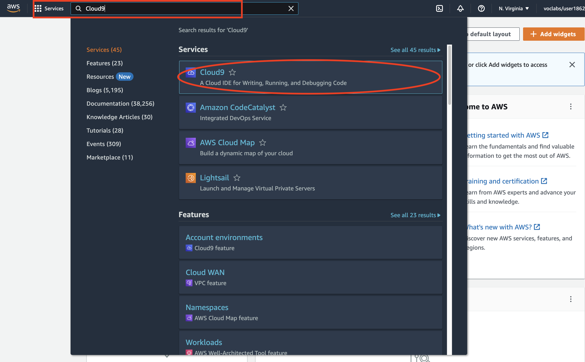

2. [Create environment] をクリック


3. Name を入力
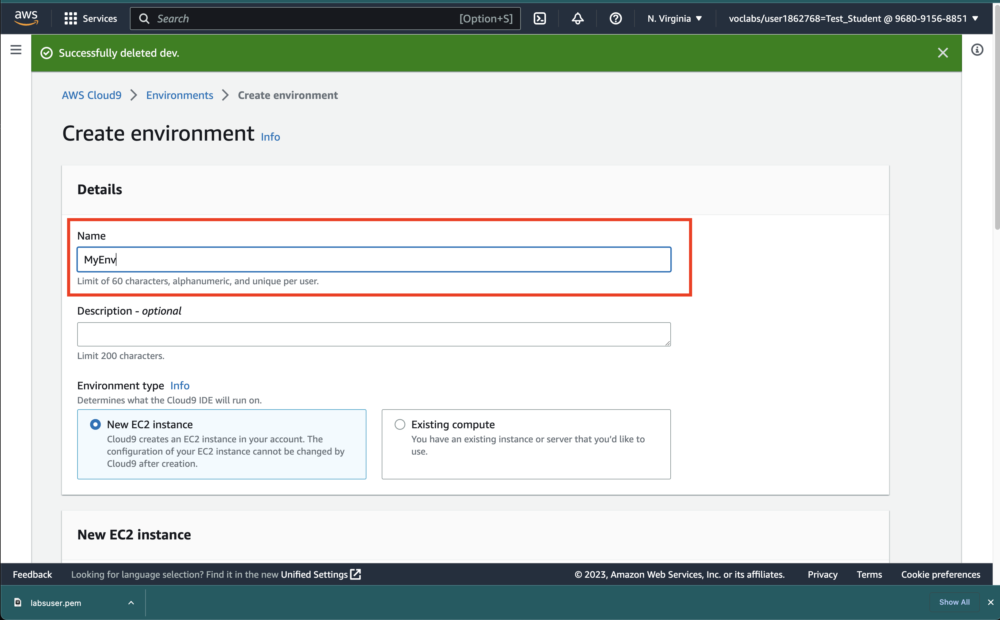

4. Secure Shell (SSH) を選択し、[Create] を押す


5. Open を押す


---
### Cloud Shell を起動する
1. AWS Management Console のサービス検索で `CloudShell` を検索して選択
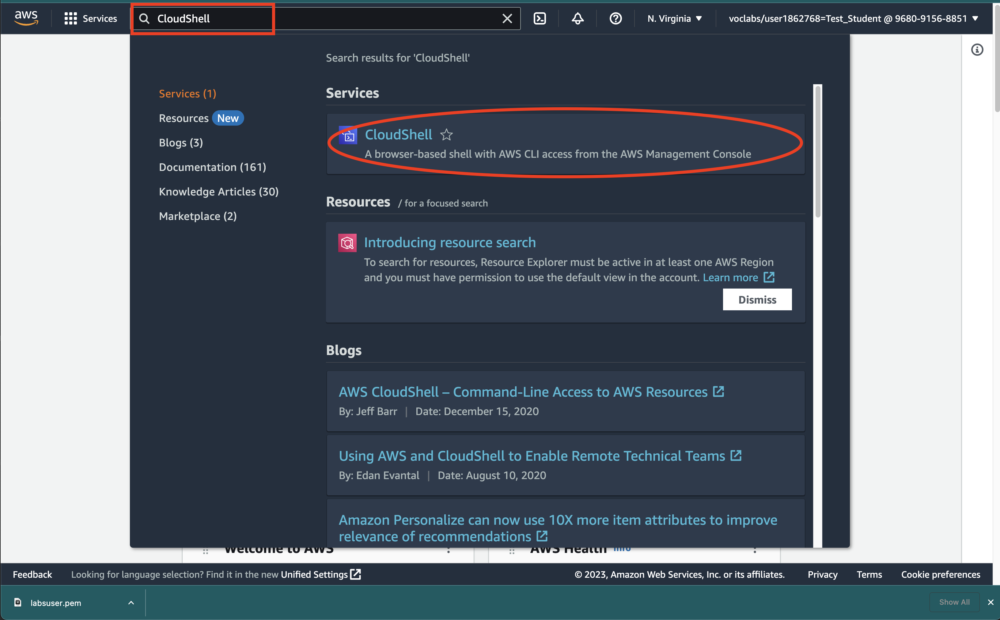

2. Do not show again をチェックして [Close] を押す
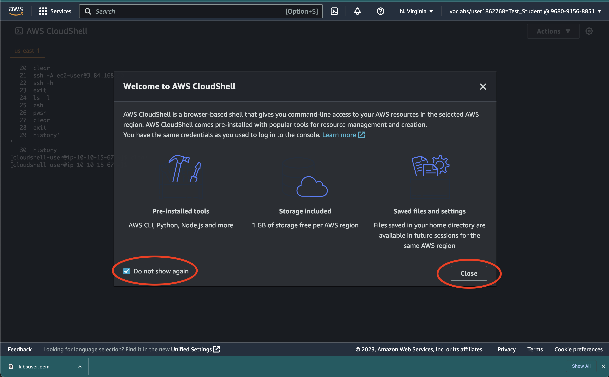

## EC2を起動する
### AWS Management Console
AWS Management Console を使用して EC2 インスタンスを作成します。

1. AWS Management Console のサービス検索で `EC2` を検索して選択
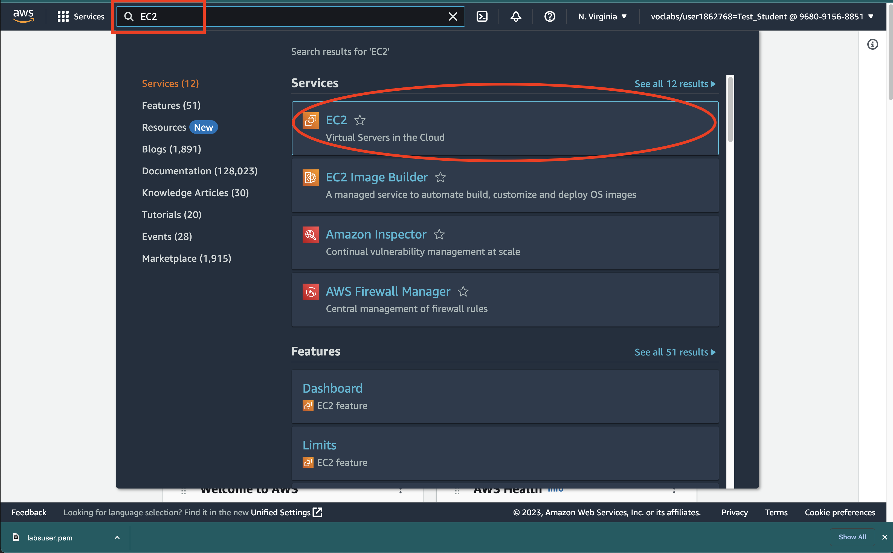

2. [Launch instance] を押す


3. Name を入力
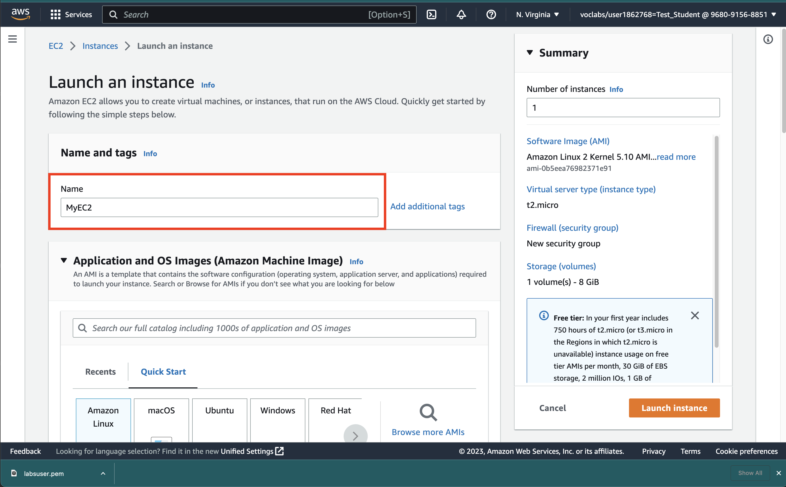

4. 使用するイメージ (AMI) を選択  
今回はデフォルト (Amazon Linuxを使用) でよい


5. Instance type と Key pair (login) を設定  
    * Instance Type: デフォルト(t2.micro)
    * Key pair name: vockey を選択


6. Network settings の設定  
今回はデフォルトでよい  
__Auto-assign public IP が Enable となっていることを確認すること__


7. IAM instance profile を設定  
    1. Advanced details の ▶ を押す
    2. IAM instance profile で LabInstanceProfile を選択する

    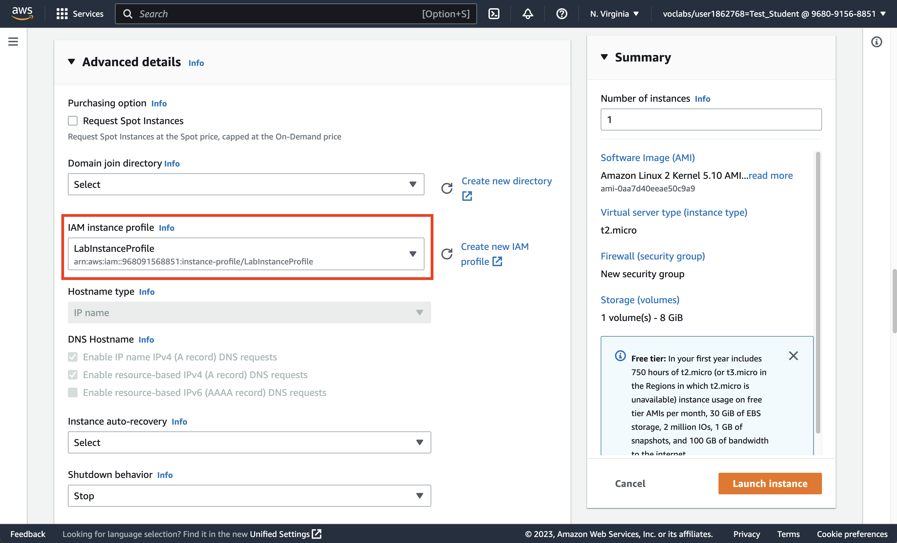

8. [Launch instance] を押す
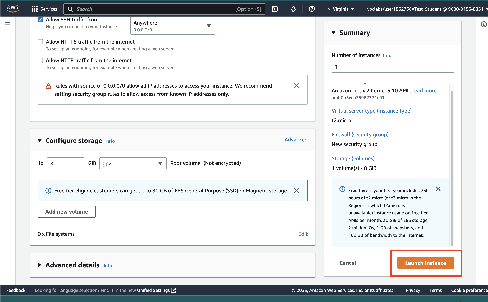

9. [View all instances] を押す


10. Instance state と Instance check を確認する
    * Instance state: Running
    * Instance check: 2/2 checks passed

---
### AWS CLI
1. AMI ID を確認する  
EC2 のインスタンス一覧の画面で作成した EC2 を選択、AMI IDをコピー
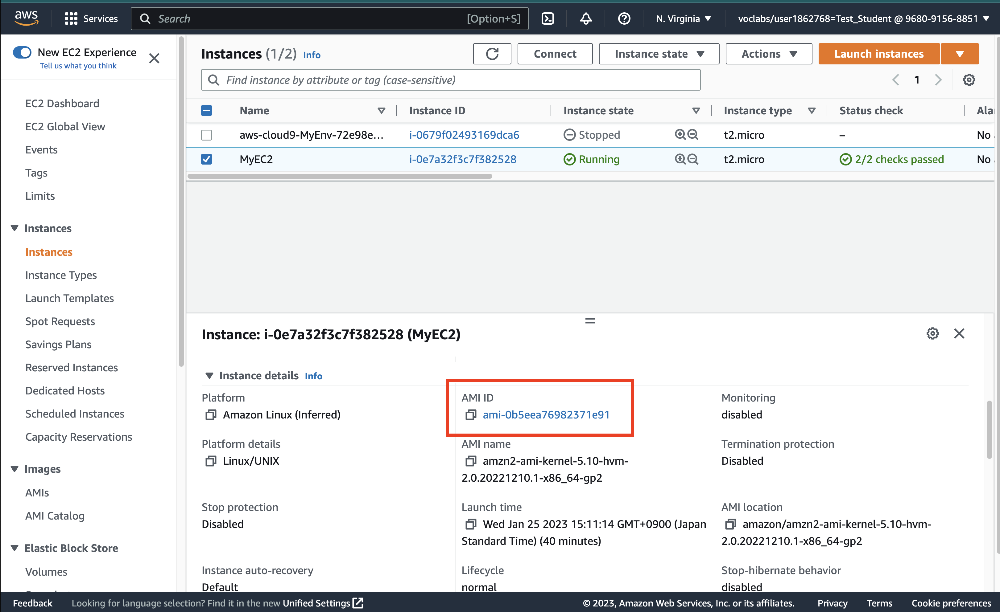

2. Security Group ID を確認する  
EC2 のインスタンス一覧の画面で作成した EC2 を選択、Security タブを選択、Security group IDをコピー


3. EC2InstanceProfile の Arn を確認する  
    サービス検索で IAM を検索して選択
    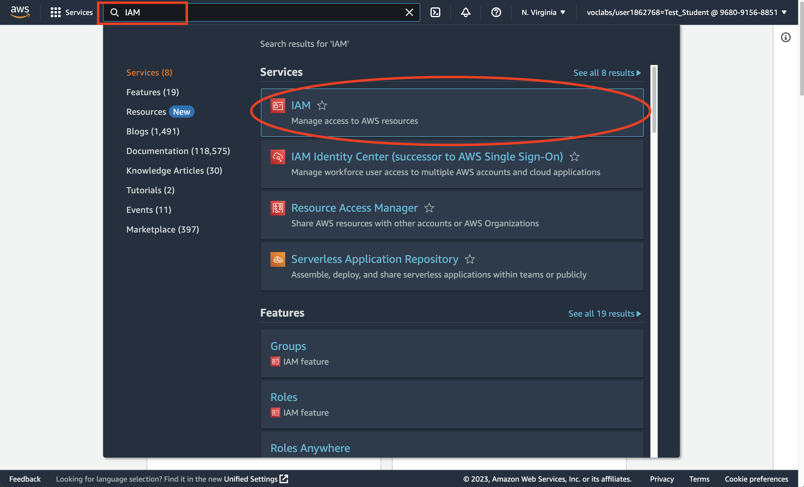

    左側のメニューで Role を選択  
    検索窓で LabRole を入力  
    LabRole を選択
    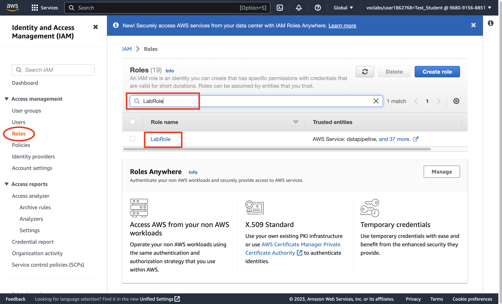

    Instance Profile ARN の値をコピー
    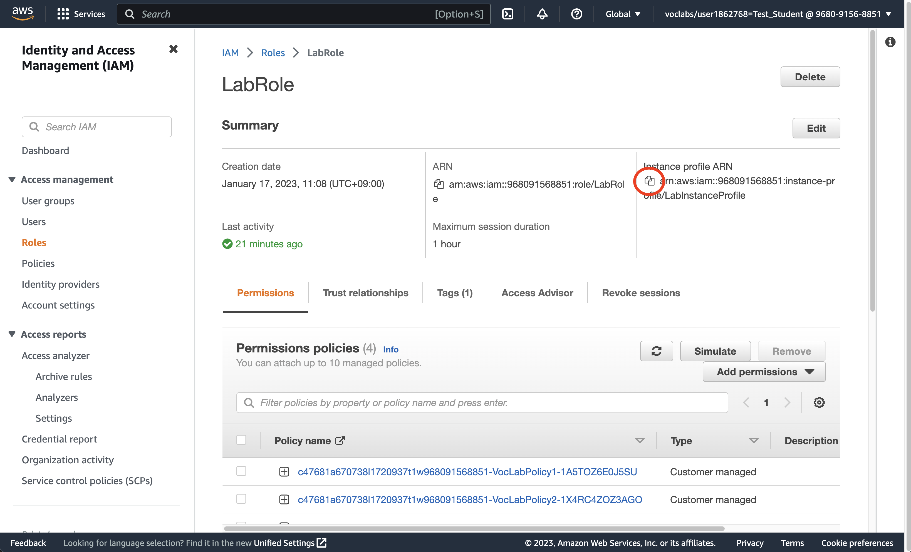

3. CloudShell を起動する

4. AWS CLI で EC2 を起動  
以下のパラメータを設定

```bash
AMI_ID=AMI ID
SECURITY_GROUP_ID=Security Group ID
ROLE=Instance Profile ARN
NAME=Instance Name
```

コマンドを実行

```bash
aws ec2 run-instances \
--image-id "$AMI_ID" \
--count 1 \
--instance-type t2.micro \
--key-name vockey \
--security-group-ids "$SECURITY_GROUP_ID" \
--associate-public-ip-address \
--iam-instance-profile "Arn=$ROLE" \
--tag-specifications "ResourceType=instance,Tags=[{Key=Name,Value=$NAME}]"
```

5. EC2 の情報を確認  
以下のパラメータを設定

```bash
INSTANCE_ID=Instance ID
```

コマンドを実行

```bash
aws ec2 describe-instances \
--instance-ids "$INSTANCE_ID"
```

実行結果を `jq` で加工する

```bash
aws ec2 describe-instances \
--instance-ids "$INSTANCE_ID" \
| jq '.Reservations[].Instances'
```

6. EC2 を停止する  
以下のパラメータを設定

```bash
INSTANCE_ID=Instance ID
```

コマンドを実行

```bash
aws ec2 stop-instances \
--instance-ids "$INSTANCE_ID"
```

EC2 インスタンスの状態を確認  
`stopped` となれば停止完了

```bash
aws ec2 describe-instances \
--instance-ids "$INSTANCE_ID" \
| jq '.Reservations[].Instances[0].State.Name'
```

7. EC2 を起動する  
以下のパラメータを設定

```bash
INSTANCE_ID=Instance ID
```

コマンドを実行

```bash
aws ec2 start-instances \
--instance-ids "$INSTANCE_ID"
```

EC2 インスタンスの状態を確認

```bash
aws ec2 describe-instances \
--instance-ids "$INSTANCE_ID" \
| jq '.Reservations[].Instances[0].State.Name'
```

8. EC2 を終了する  
以下のパラメータを設定

```bash
INSTANCE_ID=Instance ID
```

コマンドを実行

```bash
aws ec2 terminate-instances \
--instance-ids "$INSTANCE_ID"
```

EC2 インスタンスの状態を確認  
`terminated` となれば終了

```bash
aws ec2 describe-instances \
--instance-ids "$INSTANCE_ID" \
| jq '.Reservations[].Instances[0].State.Name'
```
## EC2 に接続する
EC2 インスタンスの一覧で EC2 を選択し、[Connect] を押す
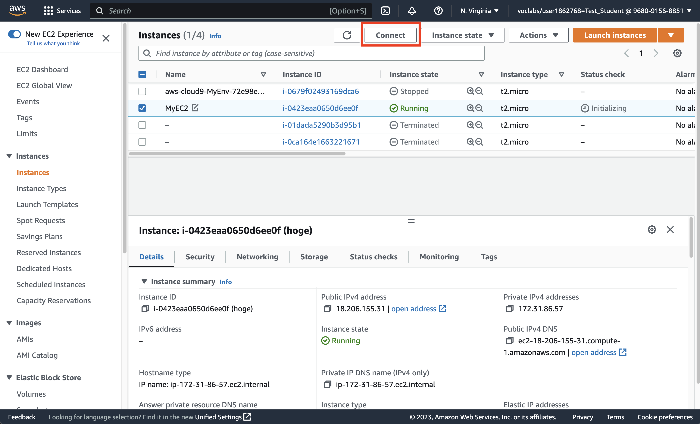

EC2 インスタンスに接続する方法は以下の通り 4種類ある
|種別                 ||
|:-------------------|:------|
|EC2 instance Connect|SSHクライアントを使ってインスタンスに接続|
|Session Manager     |インスタンスにシェルアクセス|
|SSH client          |SSHクライアントを使って、インスタンスに接続。<br/>SSHキーは接続ごとに登録し、60秒だけ有効|
|EC2 serial console  |EC2 のシリアルポートに接続|

### EC2 Instance Connect
EC2 Instance Connect の画面で [Connect] を押す


EC2 に接続してシェル (bash) が起動する
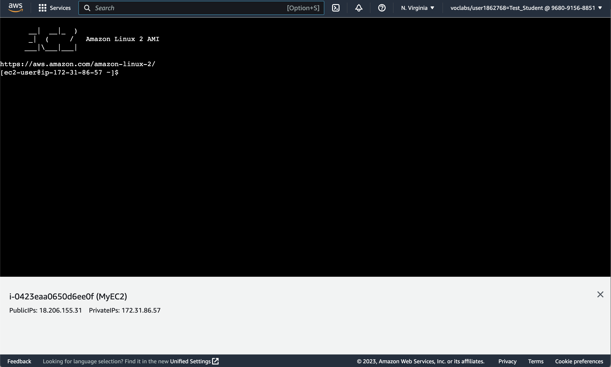

### Session Manager
Session Manager の画面で [Connect] を押す
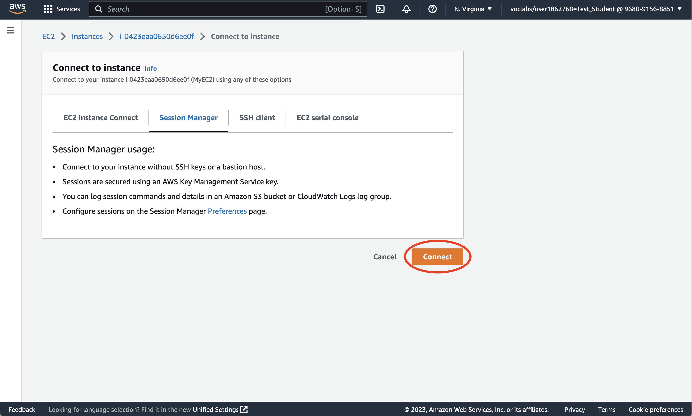

EC2 に接続してシェル (bash) が起動する
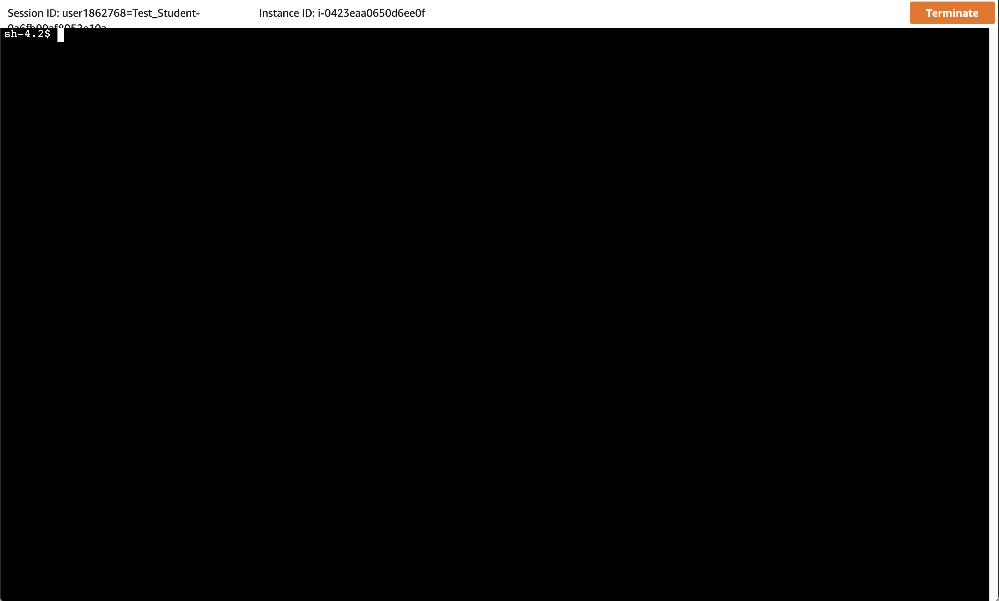

終了するには右上の [Terminate] を押す

### EC2 インスタンスにSSH で接続
#### 秘密鍵を CloudShell にアップロードする
* 秘密鍵を取得する

Leaner Lab の AWS Details を押す
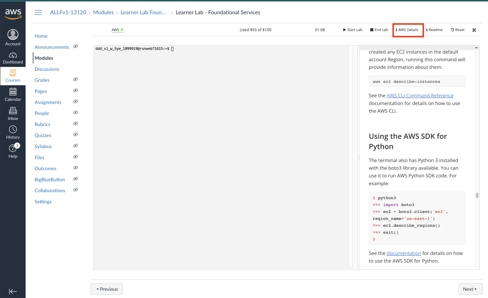

[Download PEM] を押す
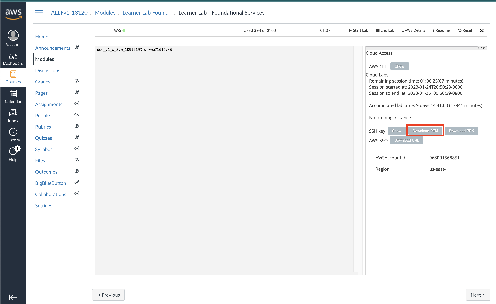

* 秘密鍵を CloudShell にアップロードする
CloudShell を起動

サービスの検索で `CloudShell` を検索して選択する

Actions -> Upload file を押す
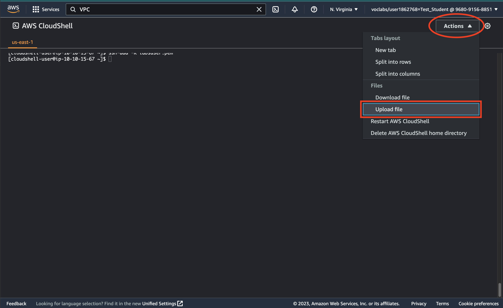

ファイルを選択、[Upload] を押す
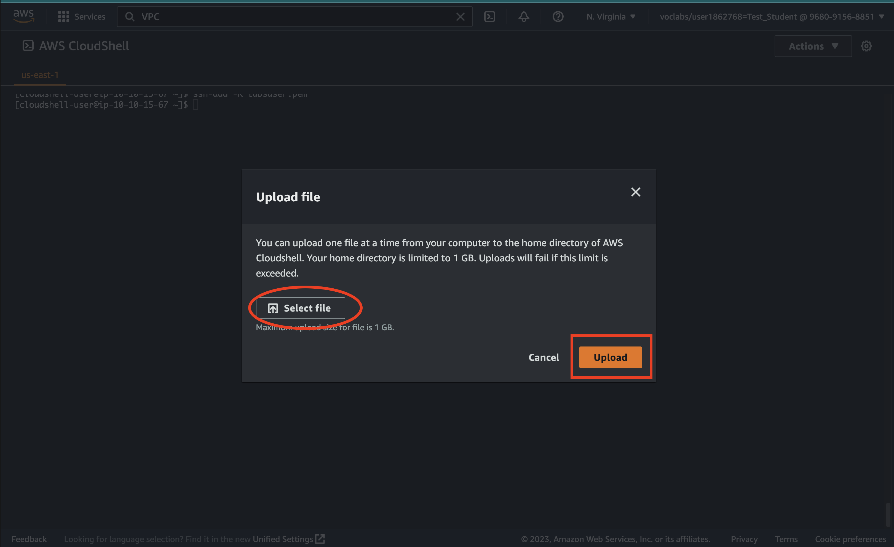

#### ssh コマンドを使用して CloudShell から EC2 インスタンスに接続する
鍵のパーミッションを変更

`ssh` コマンドで使用する鍵のパーミッションはファイルのオーナー（所有者）だけが読み込むことができる必要があります。

以下のコマンドを実行して CloudShell にアップロードした鍵のパーミッションを確認します。
    
```bash
ls -l labsuser.pem
```

CloudShell にアップロードしたファイルのパーミッションは以下のように表示されるはずです。  
以下の `-rw-rw-r--` の部分がそのファイルのパーミションを表しています。  
これはオーナー、グループに読み込み、書き込み権限があり、その他ユーザーに読み込み権限があることを意味しています。

```
-rw-rw-r-- 1 cloudshell-user cloudshell-user 1674 Jan 25 07:51 labsuser.pem
```

以下のコマンドを実行してファイルのオーナーだけが読み込むことができるようにパーミッションを変更します。

```bash
chmod 400 labsuser.pem
```

`ls` コマンドを実行して鍵のパーミッションを確認します。

```bash
ls -l labsuser.pem 
```

以下のように表示されればOKです。

```bash
-r-------- 1 cloudshell-user cloudshell-user 1674 Jan 25 07:51 labsuser.pem
```

ssh agent を起動

```bash
eval $(ssh-agent)
```

鍵を登録

```bash
ssh-add labsuser.pem
```

EC2 インスタンスに SSH で接続

```bash
PUBLIC_IP=EC2 インスタンスの Public IP
ssh -A ec2-user@"$PUBLIC_IP"
```
