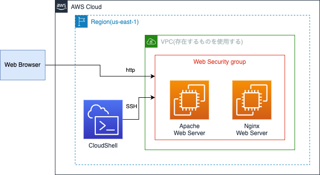

# EC2 で Web サーバを起動する
## Web サーバとは？
Web サーバは、HTTPに則り、クライアントソフトウェアのウェブブラウザに対して、HTMLやオブジェクト（画像など）の表示を提供するサービスプログラム及び、そのサービスが動作するサーバコンピュータを指す。 広義には、クライアントソフトウェアとHTTPによる通信を行うプログラム及びコンピュータ。

* [Wikipedia](https://ja.wikipedia.org/wiki/Web%E3%82%B5%E3%83%BC%E3%83%90) より
* 参考: [HTTP の歴史](https://speakerdeck.com/cupperservice/history-of-http)

---
## この課題で作成するシステムの構成
本演習では、Apache と Nginx の2種類の Web サーバを作成します。


---
## Web サーバをインストールする EC2 インスタンスを用意する
1. セキュリティグループを作成する
    * VPC サービスに移動
    * 左のメニューから Security groups を選択
    * [Create Security Group] を押す
    * 以下の項目を入力
      * Security group name: web security group
      * Description: for web server
      * VPC: default
    * [Add Rule] を押して Inbound rules を追加 (HTTP)
      * Type: HTTP
      * Source type: Anywhere-IPv4
    * [Add Rule] を押して Inbound rules を追加 (SSH)
      * Type: SSH
      * Source type: Anywhere-IPv4
    * [Create security group] を押す

2. EC2 インスタンスを 2つ作成する
    * EC2 サービスに移動
    * 左のメニューから instances を選択
    * [Launch instances] を押す
    * Name: Web Server
    * AMI: Amazon Linux 2023 を使用する
    * Key pair: vockey を使用する
    * Public IP アドレスを割り当てる
    * Number of instances: 2を入力する
    * Firewall (security groups): 1.で作成したセキュリティグループを選択する

---
## Apache HTTP サーバを起動する
1. Apache をインストールする EC2 インスタンスの Name を以下のように変更する  
Apache Web Server

2. EC2 インスタンスに CloudShell から SSH で接続する
  * [接続方法](https://github.com/cupperservice/HJ-2023/blob/main/%E8%AA%B2%E9%A1%8C/00.EC2%E3%82%92%E8%B5%B7%E5%8B%95%E3%81%99%E3%82%8B/README.md#ec2-%E3%82%A4%E3%83%B3%E3%82%B9%E3%82%BF%E3%83%B3%E3%82%B9%E3%81%ABssh-%E3%81%A7%E6%8E%A5%E7%B6%9A)

3. Apache をインストールする

    `sudo dnf install httpd -y`

4. Apache を起動する

    `sudo systemctl start httpd`

5. Apache の自動起動を有効にする

    `sudo systemctl enable httpd`

6. 以下のファイルを作成する
  * ファイル: /var/www/html/index.html
  * 中身
    ```
    <html>
    <body>テストページ</body>
    </html>
    ```

7. 正しく動作していることを確認する  
Web ブラウザから EC2 インスタンスの Public IP アドレスにアクセスする。  
以下のように表示されればOK

```
テストページ
```

---
## Nginx を起動する
1. Nginx をインストールする EC2 インスタンスの Name を以下のように変更する  
Nginx Web Server

2. EC2 インスタンスに CloudShell から SSH で接続する
  * [接続方法](https://github.com/cupperservice/HJ-2023/blob/main/%E8%AA%B2%E9%A1%8C/00.EC2%E3%82%92%E8%B5%B7%E5%8B%95%E3%81%99%E3%82%8B/README.md#ec2-%E3%82%A4%E3%83%B3%E3%82%B9%E3%82%BF%E3%83%B3%E3%82%B9%E3%81%ABssh-%E3%81%A7%E6%8E%A5%E7%B6%9A)

3. nginx をインストールする

    `sudo dnf install nginx -y`

4. nginx を起動する

    `sudo systemctl start nginx`

5. nginx の自動起動を有効にする


    `sudo systemctl enable nginx`

6. 正しく動作していることを確認する  
Web ブラウザから EC2 インスタンスの Public IP アドレスにアクセスする。  
以下のように表示されればOK

```
Welcome to nginx!
If you see this page, the nginx web server is successfully installed and working. Further configuration is required.

For online documentation and support please refer to nginx.org.
Commercial support is available at nginx.com.

Thank you for using nginx.
```

---
## 課題
Apache と nginx が起動するポート番号を 80 から 8080 に変更してみましょう。

### 定義ファイル
* Apache: /etc/httpd/conf/httpd.conf 
* nginx: /etc/nginx/nginx.conf

### 必要な作業
* 定義ファイルの80番ポートを8080番に変更する
* リスタート(`sudo systemctl restart xxxx`)
* セキュリティグループを変更

### 提出物
Web ブラウザから Web サーバにアクセスした結果のスクリーンショット
