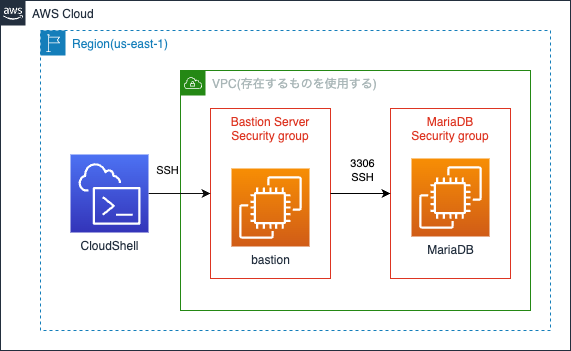

# EC2 で DB サーバを起動する
EC2 インスタンスを使用して DB サーバを起動する。  
DB サーバは、[MariaDB](https://mariadb.org/)を使用する。

---
## この課題で作成するシステムの構成
EC2 を利用して2種類のデータベース, MariaDB(RDB)を起動します。  
また、SSH ポートフォーワーディングを利用して DB サーバに接続します。



---
## SSH ポートフォーワーディング
任意のポートへの通信を別のホストを経由して別のサーバのポートに転送する。

---
## 事前準備
1. CloudShell を起動する

2. [template.yaml](./cfn/template.yaml) を CloudShell 上にダウンロードする

    以下のコマンドを実行して、[template.yaml](./cfn/template.yaml) を CloudShell 上にダウンロードする
    ```
    curl https://raw.githubusercontent.com/cupperservice/HJ-2023/main/%E8%AA%B2%E9%A1%8C/02.EC2%E3%81%A7DB%E3%82%B5%E3%83%BC%E3%83%90%E3%82%92%E8%B5%B7%E5%8B%95%E3%81%99%E3%82%8B/cfn/template.yaml -o template.yaml
    ```

3. 環境を初期化 (bastion サーバを作成する)
  * VPC サービスから VPC と Subnet の ID を確認して以下の VPC ID, Subnet ID に置き換えて実行
    ```
    VPC_ID=VPC ID
    SUBNET_ID=Subnet ID
    ```

  * CloudFormation の Stack を作成
    ```
    aws cloudformation create-stack \
    --stack-name initialize \
    --template-body file://template.yaml \
    --parameters ParameterKey=VPC,ParameterValue="$VPC_ID" \
    ParameterKey=Subnet,ParameterValue="$SUBNET_ID"
    ```
---
## MariaDB サーバ用の EC2 インスタンスを用意する
1. MariaDB サーバ用のセキュリティグループを作成する
  * VPC サービスに移動
  * 左のメニューから Security groups を選択
  * [Create Security Group] を押す
  * 以下の項目を入力
    * Security group name: db security group
    * Description: for db server
    * VPC: default
  * [Add Rule] を押して Inbound rules を追加
    * Type: SSH
    * Source: bastion security gotup
  * [Add Rule] を押して Inbound rules を追加
    * Type: Custom TCP
    * Port range: 3306
    * Source: bastion security group
  * [Create security group] を押す

2. EC2 インスタンスを作成する
  * EC2 サービスに移動
  * 左のメニューから instances を選択
  * [Launch instances] を押す
  * Name: Maria DB Server
  * AMI: Amazon Linux 2023 を使用する
  * Key pair: vockey を使用する
  * Network Settings で [Edit] を押す
    * Auto-assign public IP: Enable を選択する
  * Firewall (security groups): 1.で作成したセキュリティグループを選択する
  * [Launch instance] を押す

---
## Maria DB をインストールする
1. CloudShell から Bastion サーバに SSH で接続する
    ```
    IP=Bastion サーバの Public IP

    eval $(ssh-agent)
    ssh-add labsuser.pem
    ssh -A ec2-user@"$IP"
    ```

2. Bastion サーバから MariaDB サーバに SSH で接続する
    ```
    IP=MariaDB サーバの Private IP

    ssh ec2-user@"$IP"
    ```

2. パッケージを最新に更新する  
`sudo dnf update -y`

3. mariadb をインストール  
`sudo dnf install mariadb105-server`

4. インストール結果の確認  
    `dnf info mariadb105` を実行して以下のように表示されれば OK

    ```
    Amazon Linux 2023 repository                                                                                                                                                        27 MB/s |  14 MB     00:00    
    Amazon Linux 2023 Kernel Livepatch repository                                                                                                                                      522 kB/s | 156 kB     00:00    
    Installed Packages
    Name         : mariadb105
    Epoch        : 3
    Version      : 10.5.18
    Release      : 1.amzn2023.0.1
    Architecture : x86_64
    Size         : 18 M
    Source       : mariadb105-10.5.18-1.amzn2023.0.1.src.rpm
    Repository   : @System
    From repo    : amazonlinux
    Summary      : A very fast and robust SQL database server
    URL          : http://mariadb.org
    License      : GPLv2 and LGPLv2
    Description  : MariaDB is a community developed fork from MySQL - a multi-user, multi-threaded
                : SQL database server. It is a client/server implementation consisting of
                : a server daemon (mariadbd) and many different client programs and libraries.
                : The base package contains the standard MariaDB/MySQL client programs and
                : utilities.
    ```

5. db サーバを起動  
`sudo systemctl start mariadb`

6. mariadb をセキュアな状態に設定  
`sudo mysql_secure_installation`

    * Enter current password for root: 空 Enter
    * Switch to unix_socket authentication: 空 Enter
    * Change the root password? [Y/n] : Y を選択
      * root のパスワードを入力 (同じパスワードを2回)
    * Remove anonymous users? [Y/n] : Y を選択
    * Disallow root login remotely? [Y/n] : Y を選択
    * Remove test database and access to it? [Y/n] : Y を選択
    * Reload privilege tables now? [Y/n] : Y を選択

7. 自動起動を有効化  
`sudo systemctl enable mariadb`

---
## MariaDB にリモートから接続できるようにする。
MariaDB はデフォルトではリモートから接続することができない。  
リモートで接続できるようにセットアップする。
1. MariaDB サーバに SSH で接続する
    1. CloudShell から Bastion サーバに接続する
        ```
        IP=Bastion サーバの Public IP

        eval $(ssh-agent)
        ssh-add labsuser.pem

        ssh -A ec2-user@"$IP"
        ```
    2. Bastion サーバから MariaDB サーバに接続する
        ```
        IP=MariaDB サーバの Private IP
        ssh ec2-user@"$DB_IP"
        ```
2. MariaDB の定義ファイルを編集する  
リモートから接続できるように以下の定義ファイルを編集する
    * ファイル: /etc/my.cnf.d/mariadb-server.cnf
    * 修正内容
        * 修正前
            ```
            #
            # Allow server to accept connections on all interfaces.
            #
            #bind-address=0.0.0.0
            ```
        * 修正後
            ```
            #
            # Allow server to accept connections on all interfaces.
            #
            bind-address=0.0.0.0
            ```
3. MariaDB を再起動する  
`sudo systemctl restart mariadb`

4. MariaDB に接続する  
`mysql -uroot -p` を実行すると `Enter password:` と表示されるのでXXXで設定したパスワードを入力する

5. データベースとデータベースに接続するユーザーを作成
    1. データベースを作成  
    ```
    create database `wordpress-db`;
    ```

    2. データベースに接続するためのユーザーを作成  
    ```
    create user 'hjuser'@'%' identified by 'password00';
    ```
      * ユーザーID: hjuser
      * パスワード: password00
    
    3. 作成したユーザーにデータベース (wordpress-db) へのアクセス権限を付与  
    ```
    grant all privileges on `wordpress-db`.* to 'hjuser'@'%';
    ```

    4. 変更を有効にする  
    ```
    flush privileges;
    ```

6. MariaDB サーバ, Bastion サーバから抜ける
quit -> exit -> exit で CloudShell まで戻る

---
### CloudShell から MariaDB に接続する
1. CloudShell から MariaDB に SSH トンネリングを作成する
    ```
    BASTION_IP=Bastion サーバの Public IP
    DB_IP=MariaDB サーバの Private IP

    eval $(ssh-agent)
    ssh-add labsuser.pem

    ssh -A -N -L3306:"$DB_IP":3306 ec2-user@"$BASTION_IP"
    ```

2. 新しいタブを開く  
Actions -> New tab を選択

3. MariaDB に接続する
    ```
    mysql -h127.0.0.1 -uhjuser -p wordpress-db
    ```

# 課題
以下の 1,2,3 を実行した結果のスクリーンショットを提出する。

1. テーブルを作成する
データベースに接続した状態で、[create..sql](./create.sql) にかかれている内容をコピー & ペーストして実行する。

以下のように表示されればOK
```
+------------+-----------+-------------+-------+
| first_name | last_name | class_name  | score |
+------------+-----------+-------------+-------+
| Taro       | Suzuki    | Mathematics |    90 |
| Taro       | Suzuki    | English     |    53 |
| Taro       | Suzuki    | Chemistry   |    76 |
| Hanako     | Mochizuki | Mathematics |    67 |
| Hanako     | Mochizuki | Chemistry   |    43 |
| Yuko       | Tanaka    | Mathematics |    55 |
| Yuko       | Tanaka    | English     |    77 |
| Yuko       | Tanaka    | Chemistry   |    66 |
| Tomoko     | Hayashi   | Mathematics |   100 |
| Tomoko     | Hayashi   | English     |    79 |
| Tomoko     | Hayashi   | Chemistry   |    97 |
| Jiro       | Nakata    | Mathematics |    23 |
| Jiro       | Nakata    | English     |    45 |
| Jiro       | Nakata    | Chemistry   |    77 |
+------------+-----------+-------------+-------+
14 rows in set (0.002 sec)
```

2. 生徒の名前(first_name, last_name)と平均点を表示する。 
平均の計算はAVG関数を使います。

```
select a.first_name, a.last_name, avg(score)
from student a, score b
where a.id = b.student_id
group by a.id;
```

3. 50点以下の点数をとった生徒の名前(first_name, last_name)とクラス名、点数を表示する。

```
select a.first_name, a.last_name, c.class_name, b.score
from student a, score b, class c
where a.id = b.student_id
  and b.class_id = c.id
  and b.score <= 50
group by a.id;
```
