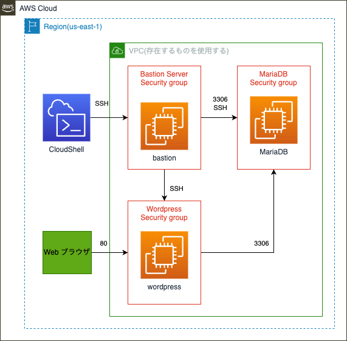
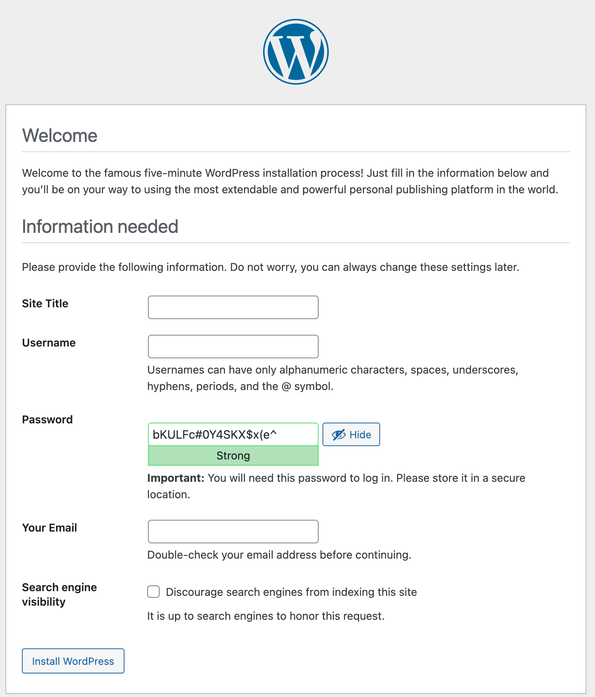
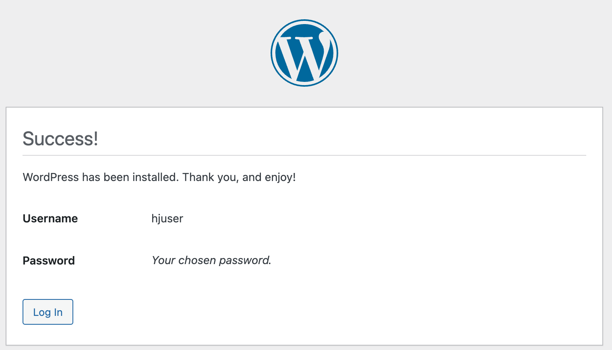
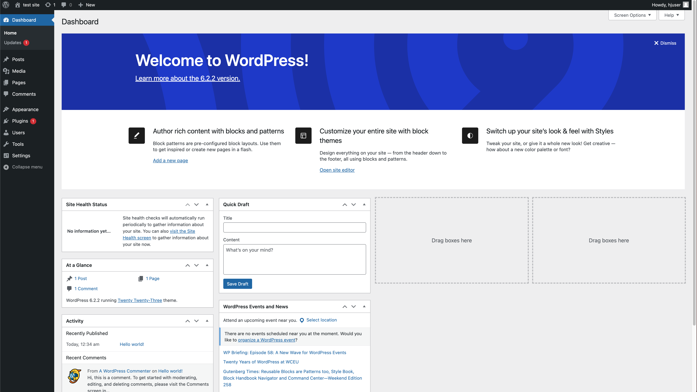

# EC2 で Workpress を起動する
[01.EC2でWebサーバを起動する](../01.EC2でWebサーバを起動する/README.md)で作成したデータベースを利用して WorkPress を起動します。

## この課題で作成するシステムの構成
bastion と MariaDB は、[EC2でDBサーバを起動する](../02.EC2%E3%81%A7DB%E3%82%B5%E3%83%BC%E3%83%90%E3%82%92%E8%B5%B7%E5%8B%95%E3%81%99%E3%82%8B/README.md)で作成したものを使用します。



## WordPress を起動する EC2 インスタンスを用意する
1. WordPress 用のセキュリティグループを作成する
  * VPC サービスに移動
  * 左のメニューから Security groups を選択
  * [Create Security Group] を押す
  * 以下の項目を入力
    * Security group name: wordpress security group
    * Description: for wordpress
    * VPC: default
  * [Add Rule] を押して Inbound rules を追加
    * Type: SSH
    * Source: bastion security group
  * [Add Rule] を押して Inbound rules を追加
    * Type: HTTP
    * Source: AnywhereIPv4
  * [Create security group] を押す

2. db security group に wordpress security group からのアクセスを許可する
  * VPC サービスに移動
  * 左のメニューから Security groups を選択
  * db security group を選択
  * Inbound roles タブを選択
  * [Edit inbound rules] を押す
  * [Add rule] を押す
  * Type: MySQL/Aurora
  * Source: wordpress security group
  * [Save rules] を押す

3. EC2 インスタンスを作成する
  * EC2 サービスに移動
  * 左のメニューから instances を選択
  * [Launch instances] を押す
  * Name: wordpress
  * AMI: Amazon Linux 2023 を使用する
  * Key pair: vockey を使用する
  * Network Settings で [Edit] を押す
    * Auto-assign public IP: Enable を選択する
  * Firewall (security groups): 1.で作成したセキュリティグループを選択する
  * [Launch instance] を押す

## WordPress をインストールする
1. CloudShell から Bastion サーバに SSH で接続する
    ```
    IP=Bastion サーバの Public IP

    eval $(ssh-agent)
    ssh-add labsuser.pem
    ssh -A ec2-user@"$IP"
    ```

2. Bastion サーバから WordPress サーバに SSH で接続する
    ```
    IP=WordPress サーバの Private IP

    ssh ec2-user@"$IP"
    ```

2. パッケージを最新に更新する  
`sudo dnf update -y`

3. WordPress に必要なパッケージをインストールする  
`sudo dnf install wget php-mysqlnd httpd php-fpm php-mysqli php-json php php-devel -y`

4. WordPress をダウンロードする  
`wget https://wordpress.org/latest.tar.gz`

5. ダウンロードしたパッケージを解凍する  
`tar -xzf latest.tar.gz`

6. wp-config-sample.php ファイルを wp-config.php という名前でコピー  
`cp wordpress/wp-config-sample.php wordpress/wp-config.php`

7. `wp-config.php` を編集する  
`vi wordpress/wp-config.php`  

    a. DB_HOST を定義する行を探して、`localhost` を書き換える  
    `define('DB_HOST', 'dbサーバのPrivate IP');`  

    a. DB_NAME を定義する行を探して、`database_name_here` を書き換える  
    `define('DB_NAME', 'wordpress-db');`  

    b. DB_USER を定義する行を探して、`username_here` を書き換える  
    `define('DB_USER', 'hjuser');`

    c. DB_PASSWORD を定義する行を探して、`your_strong_password` を書き換える  
    `define('DB_PASSWORD', 'password00');`

    d. `Authentication unique keys and salts.` を書かれたセクションを探して、`define` で始まる行を以下で置き換える

    ```
    define('AUTH_KEY',         ' #U$$+[RXN8:b^-L 0(WU_+ c+WFkI~c]o]-bHw+)/Aj[wTwSiZ<Qb[mghEXcRh-');
    define('SECURE_AUTH_KEY',  'Zsz._P=l/|y.Lq)XjlkwS1y5NJ76E6EJ.AV0pCKZZB,*~*r ?6OP$eJT@;+(ndLg');
    define('LOGGED_IN_KEY',    'ju}qwre3V*+8f_zOWf?{LlGsQ]Ye@2Jh^,8x>)Y |;(^[Iw]Pi+LG#A4R?7N`YB3');
    define('NONCE_KEY',        'P(g62HeZxEes|LnI^i=H,[XwK9I&[2s|:?0N}VJM%?;v2v]v+;+^9eXUahg@::Cj');
    define('AUTH_SALT',        'C$DpB4Hj[JK:?{ql`sRVa:{:7yShy(9A@5wg+`JJVb1fk%_-Bx*M4(qc[Qg%JT!h');
    define('SECURE_AUTH_SALT', 'd!uRu#}+q#{f$Z?Z9uFPG.${+S{n~1M&%@~gL>U>NV<zpD-@2-Es7Q1O-bp28EKv');
    define('LOGGED_IN_SALT',   ';j{00P*owZf)kVD+FVLn-~ >.|Y%Ug4#I^*LVd9QeZ^&XmK|e(76miC+&W&+^0P/');
    define('NONCE_SALT',       '-97r*V/cgxLmp?Zy4zUU4r99QQ_rGs2LTd%P;|_e1tS)8_B/,.6[=UK<J_y9?JWG');
    ```
8. WordPress を Web サーバのディレクトリにコピーする  
`sudo cp -r wordpress/* /var/www/html/`

9. `/etc/httpd/conf/httpd.conf` を編集する  
    a. <Directory "/var/www/html"> で始まるセクションを探す

    b. 以下のセクションの AllowOverride None 行を AllowOverride All に変更する

    ```
    <Directory "/var/www/html">
        #
        # Possible values for the Options directive are "None", "All",
        # or any combination of:
        #   Indexes Includes FollowSymLinks SymLinksifOwnerMatch        ExecCGI MultiViews
        #
        # Note that "MultiViews" must be named *explicitly* ---         "Options All"
        # doesn't give it to you.
        #
        # The Options directive is both complicated and important.          Please see
        # http://httpd.apache.org/docs/2.4/mod/core.html#options
        # for more information.
        #
        Options Indexes FollowSymLinks

        #
        # AllowOverride controls what directives may be placed in .       htaccess files.
        # It can be "All", "None", or any combination of the keywords:
        #   Options FileInfo AuthConfig Limit
        #
        AllowOverride None

        #
        # Controls who can get stuff from this server.
        #
        Require all granted
    </Directory>
    ```

10. Web サーバを起動する  
`sudo systemctl start httpd`

## WordPress を起動
1. Web ブラウザから WordPress サーバの Public IP にアクセスする

2. 以下の画面が表示されたら各項目を入力して、[Install WordPress] を押す


3. 以下の画面が表示されたら、[Log in] を押す


4. 以下の画面が表示されればOK


## 注意事項
EC2 の Public IP は EC2 インスタンスを再起動すると値が代わります。  
Wordpress は DB に自身の IP アドレスを保管して動作するため、そのままだと EC2 インスタンス再起動後は動作しません。

そのため、EC2 インスタンスを再起動した後は以下の SQL を MariaDB で実行してください。

```
update wp_options
set option_value = '<新アドレス(WordPressアドレス用)>'
where option_name in('siteurl','home');
```

## 提出物
環境をそのままにしてWordPress を起動で使用した Username, Password を添えて完了したことを Chat で連絡する
* End Lab を押して Lab は終了して良い。
