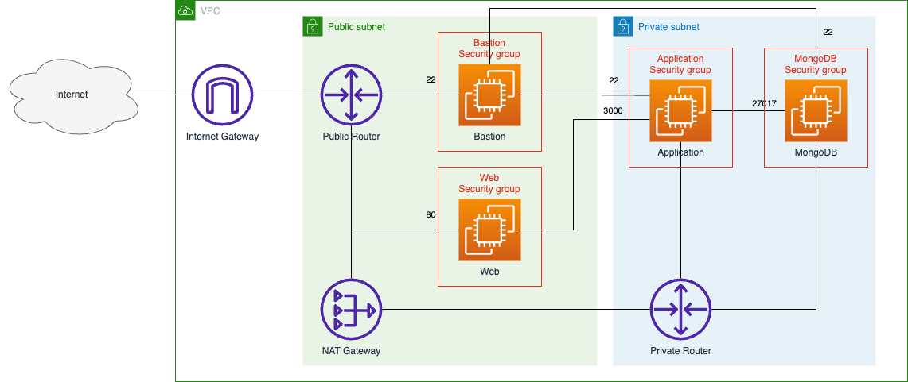
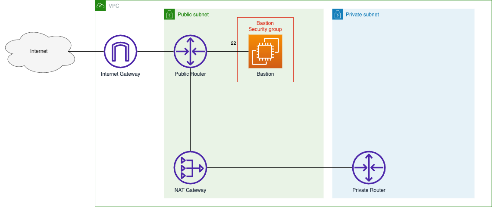
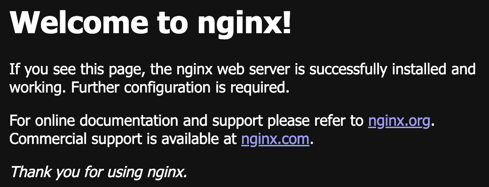
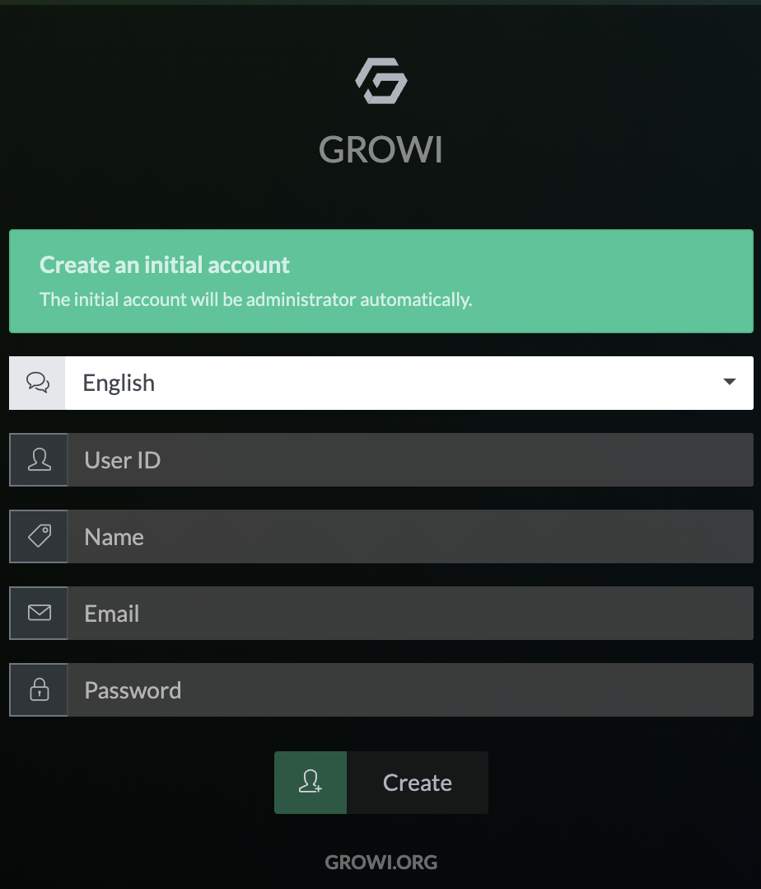

# セキュアなネットワークの構築
セキュアなネットワークを構築し、その上に [Growi](https://docs.growi.org/) を構築する。

---
## Growi とは
Markdown でドキュメントを書くことができる Wiki ツールです。

---
## この課題で作成するシステムの構成


---
## 環境の初期化
CloudFormation を使用して環境を初期化する。

初期化後の環境は以下のようになる。


1. CloudShell を起動する

2. [template.yaml](./cfn/template.yaml) を CloudShell 上にダウンロードする

    以下のコマンドを実行して、[template.yaml](./cfn/template.yaml) を CloudShell 上にダウンロードする
    ```
    curl -sL https://raw.githubusercontent.com/cupperservice/HJ-2023/main/%E8%AA%B2%E9%A1%8C/04.%E3%82%BB%E3%82%AD%E3%83%A5%E3%82%A2%E3%81%AA%E3%83%8D%E3%83%83%E3%83%88%E3%83%AF%E3%83%BC%E3%82%AF%E3%81%AE%E6%A7%8B%E7%AF%89/cfn/template.yaml -o template.yaml
    ```

3. 環境を初期化する

    CloudFormation の Stack を作成する

    以下のコマンドを実行して環境を初期化する
    ```
    aws cloudformation create-stack \
    --stack-name initialize \
    --template-body file://template.yaml
    ```
---
## 環境を構築する
### EC2 インスタンスを用意する
#### __Web サーバを用意する__
1. Web サーバ用のセキュリティグループを作成する

    以下の項目を入力する

    |Item               |Value             |
    |:------------------|:-----------------|
    |Security group name|web security group|
    |Description        |for web server    |
    |VPC                |MyVPC             |

    Inbound Roles に以下の2つのルールを追加

    |Type  |Port|Source                |
    |:-----|:---|:---------------------|
    |SSH   |22  |bastion security group|
    |HTTP  |80  |AnywhereIPv4          |

2. EC2 インスタンスを作成する

    以下の項目を入力する

    |Item               |Value            |
    |:------------------|:----------------|
    |Name               |web              |
    |AMI                |Amazon Linux 2023|
    |Instance type      |t2.micro         |
    |Key pair           |vockey           |

    Network Settings で [Edit] を押して以下を設定する

    |Item                      |Value             |
    |:-------------------------|:-----------------|
    |VPC                       |MyVPC             |
    |Subnet                    |Public-subnet1    |
    |Auto-assign public IP     |Enable            |
    |Firewall (security groups)|web security group|

#### __Application サーバを用意する__
1. Application サーバ用のセキュリティグループを作成する

    以下の項目を入力する

    |Name               |Value                     |
    |:------------------|:-------------------------|
    |Security group name|application security group|
    |Description        |for application server    |
    |VPC                |MyVPC                     |

    Inbound Roles に以下の2つのルールを追加

    |Type        |Port| Source               |
    |:-----------|:---|:---------------------|
    |SSH         |22  |bastion security group|
    |Custom TCP  |3000|web security group    |

2. EC2 インスタンスを作成する

    以下の項目を入力する

    |Item               |Value            |
    |:------------------|:----------------|
    |Name               |application      |
    |AMI                |Ubuntu           |
    |Instance type      |t2.large         |
    |Key pair           |vockey           |

    Network Settings で [Edit] を押して以下を設定する

    |Item                      |Value                     |
    |:-------------------------|:-------------------------|
    |VPC                       |MyVPC                     |
    |Subnet                    |Private-subnet1           |
    |Auto-assign public IP     |Disable                   |
    |Firewall (security groups)|application security group|

#### __MongoDB サーバを用意する__
1. MongoDB サーバ用のセキュリティグループを作成する

    以下の項目を入力する

    |Item               |Value                 |
    |:------------------|:---------------------|
    |Security group name|mongodb security group|
    |Description        |for mongodb server    |
    |VPC                |MyVPC                 |

    Inbound Roles に以下の2つのルールを追加

    |Type      |Port |Source                    |
    |:---------|:----|:-------------------------|
    |SSH       |22   |bastion security group    |
    |Custom TCP|27017|application security group|

2. EC2 インスタンスを作成する

    以下の項目を入力する

    |Item               |Value         |
    |:------------------|:-------------|
    |Name               |mongodb       |
    |AMI                |Amazon Linux 2|
    |Instance type      |t2.micro      |
    |Key pair           |vockey        |

    Network Settings で [Edit] を押して以下を設定する

    |Item                      |Value                 |
    |:-------------------------|:---------------------|
    |VPC                       |MyVPC                 |
    |Subnet                    |Private-subnet1       |
    |Auto-assign public IP     |Disable               |
    |Firewall (security groups)|mongodb security group|

---
## MongoDB サーバを構築する
1. CloudShell から mongodb サーバの EC2 インスタンスに SSH で接続する

2. 以下のファイルを作成する  
    以下のコマンドを実行して、[mongodb-org-6.0.repo](./conf/mongodb/mongodb-org-6.0.repo) を mongodb サーバ上の `/etc/yum.repos.d/mongodb-org-6.0.repo` に保管する

    ```
    sudo curl -sL https://raw.githubusercontent.com/cupperservice/HJ-2023/main/%E8%AA%B2%E9%A1%8C/04.%E3%82%BB%E3%82%AD%E3%83%A5%E3%82%A2%E3%81%AA%E3%83%8D%E3%83%83%E3%83%88%E3%83%AF%E3%83%BC%E3%82%AF%E3%81%AE%E6%A7%8B%E7%AF%89/conf/mongodb/mongodb-org-6.0.repo -o /etc/yum.repos.d/mongodb-org-6.0.repo
    ```

3. MongoDB をインストールする
    ```
    sudo yum install -y mongodb-org
    ```

4. インストール結果を確認する
    ```
    mongod --version
    ```
    以下のように表示されればOK
    ```
    mongod --version
    db version v6.0.7
    Build Info: {
      "version": "6.0.7",
      "gitVersion": "202ad4fda2618c652e35f5981ef2f903d8dd1f1a",
      "openSSLVersion": "OpenSSL 1.0.2k-fips  26 Jan 2017",
      "modules": [],
      "allocator": "tcmalloc",
      "environment": {
        "distmod": "amazon2",
        "distarch": "x86_64",
        "target_arch": "x86_64"
      }
    }
    ```

5. MongoDB を起動する
    ```
    sudo systemctl start mongod
    ```

6. 自動起動を有効にする
    ```
    sudo systemctl enable mongod
    ```

7. MongoDB の設定ファイルを編集する  
    リモートから MongoDB にアクセスできるように設定ファイルを変更する
    ```
    sudo vi /etc/mongod.conf
    ```
    `bindIp` の値を mongodb の EC2 インスタンスの Private IP アドレスに変更する

    * 変更前
      ```
      # network interfaces
      net:
        port: 27017
        bindIp: 127.0.0.1  # Enter 0.0.0.0,:: to bind to all IPv4 and IPv6 addresses or, alternatively, use the net.bindIpAll setting.
      ```
    * 変更後
      ```
      # network interfaces
      net:
        port: 27017
        bindIp: mongodb EC2 インスタンスの Private IP
      ```

8. MongoDB を再起動する
    ```
    sudo systemctl restart mongod
    ```

9. MongoDB に接続できるか確認する
    以下のコマンドを実行して MongoDB に接続できることを確認する
    ```
    mongosh --host mongodb EC2 インスタンスの Private IP アドレス
    ```

    以下のように MongoDB shell が起動すればOK
    ```
    mongosh --host 10.0.30.46
    Current Mongosh Log ID: 64a532a9a3cb3b62677c402e
    Connecting to:          mongodb://10.0.30.46:27017/?directConnection=true&appName=mongosh+1.10.1
    Using MongoDB:          6.0.7
    Using Mongosh:          1.10.1

    For mongosh info see: https://docs.mongodb.com/mongodb-shell/

    ------
      The server generated these startup warnings when booting
      2023-07-05T09:04:13.226+00:00: Access control is not enabled for the database. Read and write access to data and configuration is unrestricted
       2023-07-05T09:04:13.226+00:00: vm.max_map_count is too low
    ------

    test>
    ```

10. MongoDB shell を抜ける
    ```
    quit
    ```

---
## Application サーバを構築する
1. CloudShell から application サーバの EC2 インスタンスに SSH で接続する

2. nodejs をインストールする  
    以下のコマンドを実行して nodejs 関連のパッケージをインストールする

    a. リポジトリを設定
    ```
    curl -sL https://deb.nodesource.com/setup_14.x -o nodesource_setup.sh
    ```
    ```
    sudo bash nodesource_setup.sh
    ```

    b. nodejs をインストール
    ```
    sudo apt-get install nodejs
    ```

    c. yarn をインストール
    ```
    sudo npm install -g yarn
    ```

    d. インストール結果を確認  
    以下のように表示されればOK
    ```
    node -v
    v14.21.3
    ```
    ```
    yarn -v
    1.22.19
    ```

3. growi をセットアップする
    a. インストール先ディレクトリを作成
    ```
    sudo mkdir /opt
    ```
    ```
    sudo chown ubuntu /opt
    ```
    ```
    cd /opt
    ```

    b. growi を github から取得
    ```
    git clone https://github.com/weseek/growi.git
    ```

    c. 使用する growi のバージョンを指定
    ```
    cd growi
    ```
    ```
    git checkout -b v4.5.8 refs/tags/v4.5.8
    ```

    d. 必要なパッケージをインストール
    ```
    npm install lerna bootstrap
    ```
    ```
    npx lerna bootstrap
    ```

4. growi の起動設定をセットアップ

    a. 環境変数の定義ファイルを作成

    以下のコマンドを実行して、[growi.conf](./conf/growi/growi.conf) を application サーバ上の `/opt/growi/growi.conf` に保管する

    ```
    curl -sL https://raw.githubusercontent.com/cupperservice/HJ-2023/main/%E8%AA%B2%E9%A1%8C/04.%E3%82%BB%E3%82%AD%E3%83%A5%E3%82%A2%E3%81%AA%E3%83%8D%E3%83%83%E3%83%88%E3%83%AF%E3%83%BC%E3%82%AF%E3%81%AE%E6%A7%8B%E7%AF%89/conf/growi/growi.conf -o /opt/growi/growi.conf
    ```

    b. `/opt/growi/growi.conf` を編集

    `<mongodb>` の部分を mongodb サーバの Private IP アドレスに変更する

    * 変更前
      ```
      MONGO_URI="mongodb://<mongodb>:27017/growi"
      ```
    * 変更後
      ```
      MONGO_URI="mongodb://10.0.30.210:27017/growi"
      ```

    c. ユニットファイルを作成

    以下のコマンドを実行して、[growi.service](./conf/growi/growi.service) を application サーバ上の `/etc/systemd/system/growi.service` に保管する

    ```
    sudo curl -sL https://raw.githubusercontent.com/cupperservice/HJ-2023/main/%E8%AA%B2%E9%A1%8C/04.%E3%82%BB%E3%82%AD%E3%83%A5%E3%82%A2%E3%81%AA%E3%83%8D%E3%83%83%E3%83%88%E3%83%AF%E3%83%BC%E3%82%AF%E3%81%AE%E6%A7%8B%E7%AF%89/conf/growi/growi.service -o /etc/systemd/system/growi.service
    ```

5. 定義を `systemd` に認識させる
    ```
    sudo systemctl daemon-reload
    ```

6. growi を起動
    ```
    sudo systemctl start growi
    ```
7. 起動結果を確認
    ```
    sudo journalctl -f -u growi
    ```

    以下のように表示されればOK
    ```
    Jul 08 00:03:51 ip-10-0-30-92 npm[2806]: > growi@4.5.8 start /opt/growi
    Jul 08 00:03:51 ip-10-0-30-92 npm[2806]: > yarn app:server
    Jul 08 00:03:51 ip-10-0-30-92 npm[3684]: yarn run v1.22.19
    Jul 08 00:03:51 ip-10-0-30-92 npm[3684]: $ yarn lerna run server --scope @growi/app
    Jul 08 00:03:51 ip-10-0-30-92 npm[3696]: $ /opt/growi/node_modules/.bin/lerna run server --scope @growi/app
    Jul 08 00:03:52 ip-10-0-30-92 npm[3708]: lerna notice cli v4.0.0
    Jul 08 00:03:52 ip-10-0-30-92 npm[3708]: lerna notice filter including "@growi/app"
    Jul 08 00:03:52 ip-10-0-30-92 npm[3708]: lerna info filter [ '@growi/app' ]
    Jul 08 00:03:52 ip-10-0-30-92 npm[3708]: lerna info Executing command in 1 package: "yarn run server"
    ```

8. growi の自動起動を設定
    ```
    sudo systemctl enable growi
    ```
---
## Web サーバを構築する
### Nginx をインストールする
1. web サーバに CloudShell から SSH で接続する

2. nginx をインストールする
    ```
    sudo dnf install nginx -y
    ```

3. nginx を起動する
    ```
    sudo systemctl start nginx
    ```

4. nginx の自動起動を有効にする
    ```
    sudo systemctl enable nginx
    ```

5. インストール結果を確認する
    
    Web ブラウザから web サーバの Public IP アドレスにアクセスする

    以下のように表示されればOK
    

### リバースプロキシの設定
1. ファイルをダウンロードする  

    以下のコマンドを実行して、[growi.conf](./conf/nginx/growi.conf) を application サーバ上の `/etc/nginx/conf.d/growi.conf` に保管する

    ```
    sudo curl -sL https://raw.githubusercontent.com/cupperservice/HJ-2023/main/%E8%AA%B2%E9%A1%8C/04.%E3%82%BB%E3%82%AD%E3%83%A5%E3%82%A2%E3%81%AA%E3%83%8D%E3%83%83%E3%83%88%E3%83%AF%E3%83%BC%E3%82%AF%E3%81%AE%E6%A7%8B%E7%AF%89/conf/nginx/growi.conf -o /etc/nginx/conf.d/growi.conf
    ```

2. 1.のファイルを編集  
    vi で編集する例  
    `sudo vi /etc/nginx/conf.d/growi.conf`

    `<application>`の部分を Application サーバの Private IPv4 address に変更する

    * 編集前
        ```
        upstream growi {
            server <application>:3000;
        }
        ```

    * 編集後の例
        ```
        upstream growi {
            server 10.0.10.200:3000;
        }
        ```

    `server_name`を探して、`<server>` を Web サーバの Public IPv4 address に変更する

    * 編集前
        ```
        server {
            listen 80;
            server_name <server>;
        ```

    * 編集後の例
        ```
        server {
            listen 80;
            server_name 54.175.66.232;
        ```

3. Nginx を再起動する  
以下のコマンドを実行して Nginx を再起動する  
`sudo systemctl restart nginx`

## Growi が動作することを確認
Web ブラウザから web サーバの Public IP アドレスにアクセスして以下のように表示されればOK


