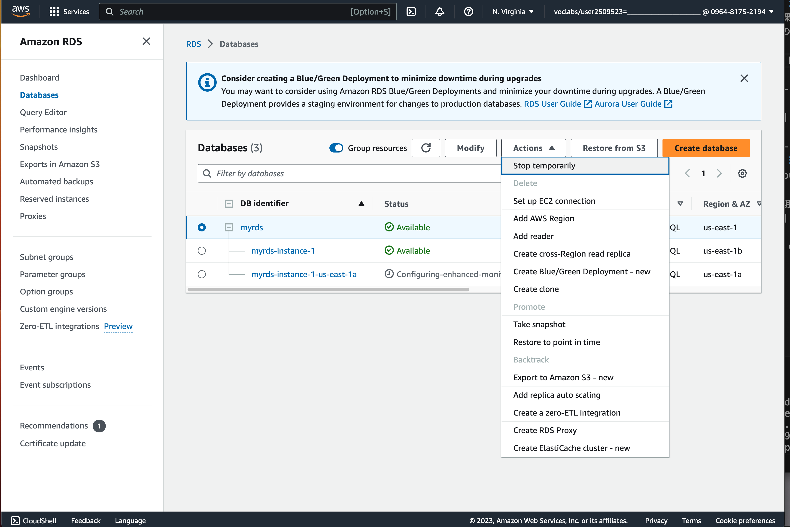
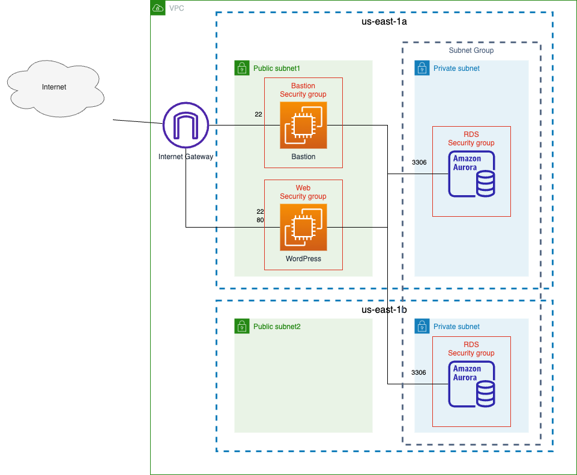
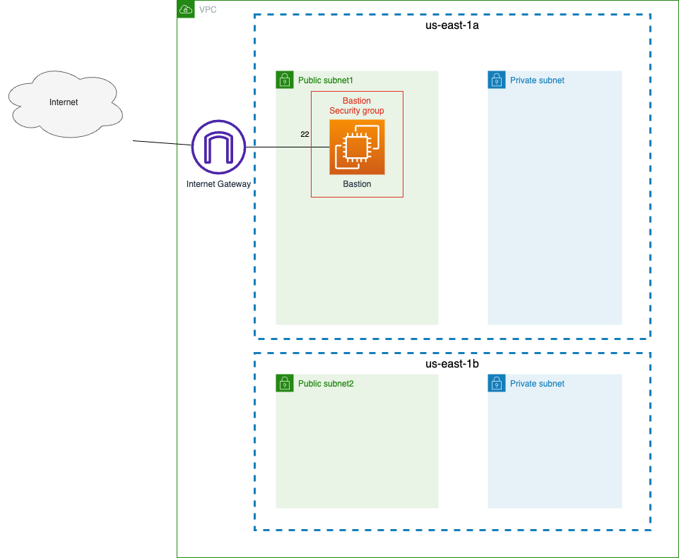

# RDS を触ってみる

---
## 注意事項
本課題で作成するAuroraは動作させておくとクレジットの消費が激しいです。  
そのため、Lab終了時には Aurora を停止するようにしてください。



---
## この課題で作成するシステムの構成


---
## 環境の初期化
CloudFormation を使用して環境を初期化します。

初期化後の環境は以下のようになります。


1. CloudShell を起動する

2. [template.yaml](./cfn/template.yaml) を CloudShell 上にダウンロードする

    以下のコマンドを実行して、[template.yaml](./cfn/template.yaml) を CloudShell 上にダウンロードする
    ```
    curl -sL https://raw.githubusercontent.com/cupperservice/HJ-2023/main/%E8%AA%B2%E9%A1%8C/05.RDS%E3%82%92%E8%A7%A6%E3%81%A3%E3%81%A6%E3%81%BF%E3%82%8B/cfn/template.yaml -o template.yaml
    ```

3. 環境を初期化  
    CloudFormation の Stack を作成

    以下のコマンドを実行して環境を初期化します。
    ```
    aws cloudformation create-stack \
    --stack-name rds \
    --template-body file://template.yaml
    ```

---
## RDS を作成する
### セキュリティグループを作成する
以下の項目を入力する

|Item               | Value            |
|:------------------|:-----------------|
|Security group name|rds security group|
|Description        |for rds           |
|VPC                |MyVPC             |

Inbound Roles に以下のルールを追加

|Type        |Port|Source                |
|:-----------|:---|:---------------------|
|MYSQL/Aurora|3306|bastion security group|

### サブネットグループを作成する
以下の項目を入力する

|Item       | Value         |
|:----------|:--------------|
|Name       |my subnet group|
|Description|for rds        |
|VPC        |MyVPC          |

Add subnets で以下を設定する

|Item              | Value                       |
|:-----------------|:----------------------------|
|Availability Zones|- us-east-1a<br/>- us-east-1b|
|Subnets           |- Private-subnet1<br/>- Private-subnet2|

### RDS を作成する
以下の項目を設定して RDS を作成する

#### 1. Choose a database creation method
* Standard create

#### 2. Engine options
* Aurora (MySQL Compatible)
* Engine Version: Aurora MySQL 3.03.1 (compatible with MySQL 8.0.26)

#### 3. Templates
* Dev/Test

#### 4. Settings
|                       |          |
|:----------------------|:---------|
|DB instance identifier |MyRDS     |
|Master username        |admin     |
|Master password        |password00|
|Confirm master password|password00|

#### 5. Cluster storage configuration
* Aurora Standard

#### 6. Instance configuration
* Burstable classes (includes t classes)
* db.t3.medium

#### 7. Availability & durability
* Create an Aurora Replica or Reader node in a different AZ (recommended for scaled availability)

#### 8. Connectivity
|||
|:-|:-|
|Compute resource|Don’t connect to an EC2 compute resource|
|Network type|IPv4|
|Virtual private cloud(VPC)|MyVPC|
|DB subnet group|my subnet group|
|Public access|No|
|VPC security group (firewall)|rds security group<br/>__default はチェックしない__|

#### 9. Database authentication
どれもチェックしない

#### 10. Monitoring
|||
|:-|:-|
|Monitoring|Enable Enhanced monitoring のチェックを外す|

#### 11. Additional configuration
データベース名にハイフンが入っていると作成できないのでここではデータベース名は指定しない

---
## データベースにデータを投入する
1. CloudShell から データベースへ bastion サーバを経由した SSH トンネリングを確立する

2. CloudShell で mysql コマンドを使用してデータベースに接続し、以下の SQL を実行する
    * [create.sql](./sql/create.sql)

__接続するデータベースのエンドポイントは Writer のエンドポイント__

---
## Reader, Writer のそれぞれに接続する
以下の SQL を Reader, Writer のそれぞれで実行する

```
select a.first_name, a.last_name, avg(score)
from student a, score b
where a.id = b.student_id
group by a.id;
```

```
show variables like "innodb_read_only";
```

---
## フェールオーバー
データベースをフェールオーバーし Writer と Reader を入れ替える
1. RDS の画面の一覧で Reader インスタンスを選択する
2. Actions -> Failover 
3. RDS の画面の一覧の Role で Writer と Reader が入れ替わったことを確認する
4. 以下の SQL を Reader, Writer のそれぞれで実行する
    ```
    show variables like "innodb_read_only";
    ```

---
## 作成した RDS を使用して WordPress を起動する
[EC2でWordPressを起動する](../03.EC2でWordPressを起動する/README.md) を参考にして 作成した RDS を使用して WordPress を起動する

### 注意点
1. wordpress は RDSとVPC(MyVPC) 上に用意する必要がある。
2. RDS は wordpress からの通信を受け付ける必要がある。
3. wordpress の接続先を RDS に変更する必要がある。

---
## 提出物
演習完了後にチャットで完了を報告する

End Lab でラボは終了して良い
