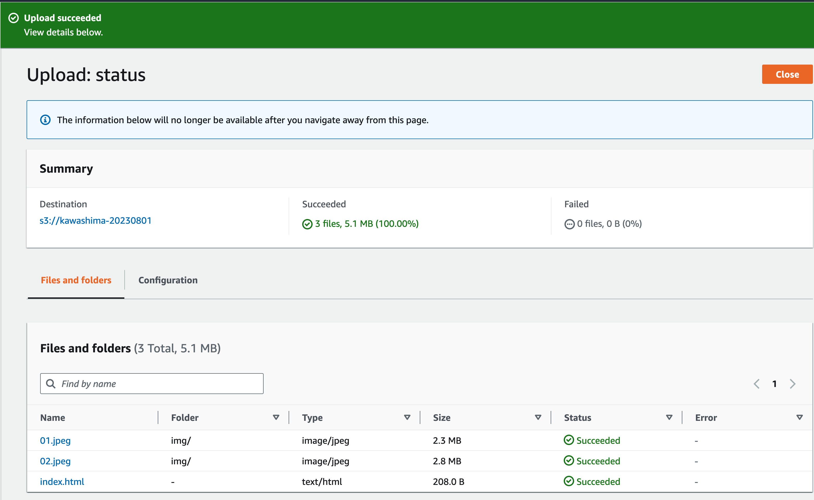

# S3 で静的コンテンツを配信する
S3とCloudFrontを使用して静的コンテンツを配信する方法を学習します。

この演習では S3 のみを使用する方法（非推奨）と S3 と CloudFront を組み合わせて静的コンテンツを配信する方法を学習します。

## S3 とは
https://docs.aws.amazon.com/ja_jp/AmazonS3/latest/userguide/Welcome.html

## CloudFront とは
https://docs.aws.amazon.com/ja_jp/AmazonCloudFront/latest/DeveloperGuide/Introduction.html

## Web Site Hosting を使用する
Web ブラウザから S3 のバケットに直接 アクセスできるようにして、静的コンテンツを配信する

この方法では HTTPS でアクセスすることはできないため、注意が必要

### 1. バケットを作成する
S3 サービスの画面から バケットを作成する
#### General configuration
* Bucket name: 任意の値 (すべてのリージョンで一意にする必要がある)
* AWS Region: US East (N. Virginia) us-east-1

### 2. 静的 Web サイトホスティングを有効にする

S3 の画面でバケットを選択 -> Properties タブを選択し、Static website hosting を有効にする

---
#### Static website hosting
Enable を選択

---
#### Index document
`index.html` を入力する

### 3. Public access を有効にする

S3 の画面でバケットを選択 -> Permissions タブを選択し、Public access を有効にする

---
#### Block public access (bucket settings)
[Edit] を押して `Block all public access` のチェックを外す

### 4. バケットポリシーを設定する
S3 の画面でバケットを選択 -> Permissions タブを選択し、バケットポリシーを設定する

---
#### Bucket policy
[Edit] を押して以下のポリシーを貼りつける

`Bucket-Name` は自分のバケットの名前に置き換える

```
{
    "Version": "2012-10-17",
    "Statement": [
        {
            "Sid": "PublicReadGetObject",
            "Effect": "Allow",
            "Principal": "*",
            "Action": [
                "s3:GetObject"
            ],
            "Resource": [
                "arn:aws:s3:::Bucket-Name/*"
            ]
        }
    ]
}
```

### 5. コンテンツをバケットにアップロードする
[contents](./contents/) の下のファイルとディレクトリをバケットにアップロードする

バケットの内容が以下のようになっていればOK


### 6. 静的コンテンツを表示する
ブラウザから S3 の URL にアクセスして静的コンテンツが表示されることを確認する

* S3 の URL は以下で確認する

    S3 の画面でバケットを選択 -> Properties タブを選択、Static website hosting に記載されている

## CloudFront を使用する
CloudFront を経由して S3 のバケットに保管した静的コンテンツを配信する

### 1. バケットを作成する
S3 サービスの画面から バケットを作成する
#### General configuration
* Bucket name: 任意の値 (すべてのリージョンで一意にする必要がある)
* AWS Region: US East (N. Virginia) us-east-1

### 2. コンテンツをバケットにアップロードする
[contents](./contents/) の下のファイルとディレクトリをバケットにアップロードする

バケットの内容が以下のようになっていればOK


### 3. CloudFront でディストリビューションを作成する
CloudFront のサービスに移動し、「Create distribution」を押してディストリビューションを作成する

* Origin domain  
  作成した S3 バケットを選択
* Origin access  
  Origin access control settings (recomended) を選択
* Origin access control:  
  「Create control setting」を押す  
  ポップアップが表示されるのでそのまま「Create」を押す
* Web Application Firewall (WAF)  
  Do not enable security protections を選択する

ディストリビューションの作成が完了するまで数分間待つ

### 4. S3 のバケットポリシーを更新する
CloudFront の画面でディストリビューションを選択
Origins タブで Origin を選択
「Edit」を押す
「Copy policy」を押す
Go to S3 bucket permissions

### 4. 静的コンテンツを表示する
ブラウザから CloudFront の URL にアクセスして静的コンテンツが表示されることを確認する
