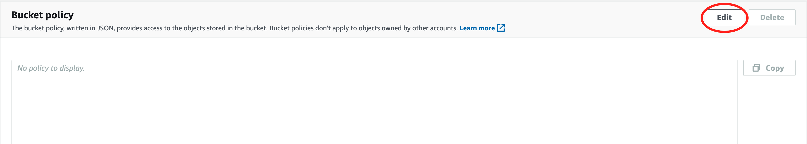
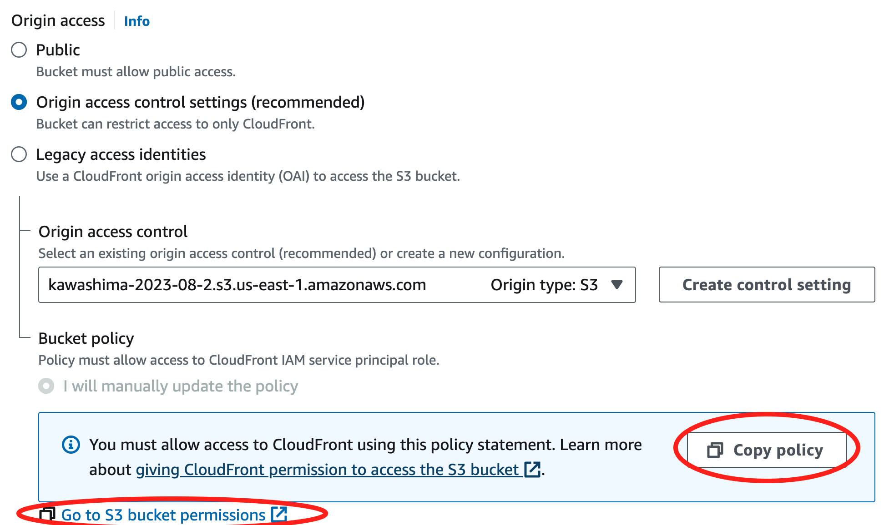

# S3 で静的コンテンツを配信する
このハンズオンでは、S3 と CloudFront を使用して静的コンテンツを配信する方法を学習します。

S3 のみを使用する方法（非推奨）と S3 と CloudFront を組み合わせて静的コンテンツを配信する２種類の方法を紹介します。

* S3 のみを使用する場合の構成


* CloudFront と S3 を組み合わせる場合の構成


## S3 とは
[Amazon S3](https://docs.aws.amazon.com/ja_jp/AmazonS3/latest/userguide/Welcome.html)

## CloudFront とは
[Amazon CloudFront](https://docs.aws.amazon.com/ja_jp/AmazonCloudFront/latest/DeveloperGuide/Introduction.html)

## Web Site Hosting を使用する
Web ブラウザから S3 のバケットに直接 アクセスできるようにして、静的コンテンツを配信する方法です。

以下の手順で 静的 Web サイトを配信します。

1. バケットを作成する
2. 静的 Web サイトホスティングを有効にする
3. Public access を有効にする
4. バケットポリシーを設定する
5. コンテンツをバケットにアップロードする

この方法では HTTPS でアクセスすることはできないため、注意が必要です。

### バケットを作成する
S3 サービスの画面から バケットを作成します。

---
General configuration

* Bucket name: 任意の値 (すべてのリージョンで一意にする必要がある)
* AWS Region: US East (N. Virginia) us-east-1

### 静的 Web サイトホスティングを有効にする

S3 の画面でバケットを選択 -> Properties タブを選択し、Static website hosting を有効にします。

一番下の「Static website hosting」で 「Edit」 を押します。


---
Static website hosting

* Enable を選択

---
Index document

* `index.html` を入力する


### Public access を有効にする

S3 の画面でバケットを選択 -> Permissions タブを選択し、Public access を有効にします。

「Block public access (bucket settings)」で「Edit」を押します。


---
Block public access (bucket settings)

* `Block all public access` のチェックを外して、「Save changes」を押します。

Public access を有効にしてよいか確認するダイアログが表示されますので、`confirm` を入力して「Confirm」を押します。


### バケットポリシーを設定する
S3 の画面でバケットを選択 -> Permissions タブを選択します。

「Bucket policy」で「Edit」を押してバケットポリシーを設定します。



---
Bucket policy

* 以下のポリシーを貼りつけて「Save Changes」を押します。

`Bucket-Name` は自分で作成したバケットの名前に置き換えてください。

```text
{
    "Version": "2012-10-17",
    "Statement": [
        {
            "Sid": "PublicReadGetObject",
            "Effect": "Allow",
            "Principal": "*",
            "Action": [
                "s3:GetObject"
            ],
            "Resource": [
                "arn:aws:s3:::Bucket-Name/*"
            ]
        }
    ]
}
```

### コンテンツをバケットにアップロードする
コンテンツを S3 にアップロードします。

ブラウザから S3 の URL にアクセスして静的コンテンツが表示されることを確認しましょう。

* S3 の URL は以下で確認する

    S3 の画面でバケットを選択 -> Properties タブを選択、Static website hosting に記載されています。


## CloudFront を使用する
CloudFront を経由して S3 のバケットに保管した静的コンテンツを配信する

1. バケットを作成する
2. コンテンツをバケットにアップロードする
3. CloudFront でディストリビューションを作成する
4. S3 のバケットポリシーを更新する

### バケットを作成する
S3 サービスの画面から バケットを作成します。

---
General configuration

* Bucket name: 任意の値 (すべてのリージョンで一意にする必要がある)
* AWS Region: US East (N. Virginia) us-east-1

### コンテンツをバケットにアップロードする
コンテンツを S3 にアップロードします。

### CloudFront でディストリビューションを作成する
CloudFront のサービスに移動し、「Create distribution」を押してディストリビューションを作成する


* Origin domain  
  作成した S3 バケットを選択
* Origin access  
  Origin access control settings (recomended) を選択
* Origin access control:  
  「Create control setting」を押す  
  ポップアップが表示されるのでそのまま「Create」を押す


* Web Application Firewall (WAF)  
  Do not enable security protections を選択する


* Default root object  
  `index.html` を入力する


ディストリビューションの作成が完了するまで数分間待つ

### S3 のバケットポリシーを更新する
CloudFront の画面でディストリビューションを選択します。

Origins タブで Origin を選択して、「Edit」を押します。


「Copy policy」を押して、`Go to S3 bucket permissions` のリンクから S3 の画面に移動します。



Bucket Policy にコピーしたポリシーを貼り付けます。

ポリシーを貼り付けた結果


### 静的コンテンツを表示する
Web ブラウザから CloudFront の URL にアクセスして静的コンテンツが表示されることを確認します。

Web ブラウザからアクセスする URL は CloudFront の Distribution の画面から確認できます。

